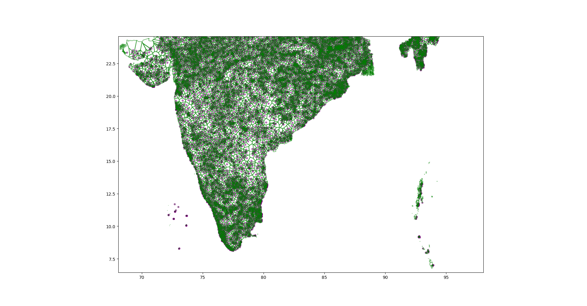

# Data Preparation for Geospatial Analysis & ML with Laguerre-Voronoi in Python

In this article the application of Laguerre-Vornoi tessellation to Demographic and Health Survey (DHS) data is explored. 
A pipeline for cleaning and transforming the DHS data is proposed along with the associated python code.

## Demographic and Health Survey data
DHS surveys contain confidential information that could potentially be used to identify an individual through unique information or [PII](https://en.wikipedia.org/wiki/Personal_data). To avoid this the [DHS Program](https://dhsprogram.com/) has developed an approach to degrade accuracy of the GPS coordinates so that true place of residence cannot be derived. In all DHS surveys the center GPS coordinate of the populated place in a cluster is recorded and separate degradation error values are applied depending on whether a cluster is _urban_ or _rural_. A random error of 5 km maximum in rural areas and 2 km maximum in urban areas is applied, this decreases the likelihood of household identification by tenfold. The new list of coordinates can be thought of as having a circular error buffer zone of (5km or 2km) within which the actual value resides. This degradation poses a challenge for further data analysis and machine learning tasks on this data. Comprehensive and accurate measurements of economic well-being are fundamental inputs into both research and policy making. The final goal of the [World Resources Institute Project](https://www.solveforgood.org/proj/47/) is to be able to predict Demographic and Health Survey based estimates with Remote Sensing and OpenStreetMaps data for finest spatial microregions in India.

## Laguerre Voronoi Diagrams
Introduced in 1985 in <a href="#ref1">[1]</a>, Laguerre Voronoi diagrams are an extension of the concept of Voronoi diagrams for _n_ points in the plane to that of Laguerre geometry for _n_ circles in the plane. It is a partition of the Euclidean plane into polygonal cells defined from a set of circles and are also known as [Power Diagrams](https://en.wikipedia.org/wiki/Power_diagram). The diagrams used in this article were generated from the following [GitHub Gist](https://gist.github.com/sunayana/a3a564058e97752f726ca65d56fab529)


## Laguerre Voronoi Tessellation of DHS Data
Due to the nature of the degradation introduced in the DHS Data, Laguerre Voronoi tessellation of the DHS dataset is a viable model to create polygonal partition of the map of a country for further data analysis. India is taken as an example for introducing the pipeline.
### Preprocessing DHS Data
- Note that the intersection of 0 degrees latitude (Equator) and 0 degrees longitude(Prime Meridian) on the map falls in the middle of the Atlantic Ocean, in the Gulf of Guinea off the coast of western Africa.

<figure>
    
    <figcaption>Image from <a href="ref3">[3]</a> showing intersection of Equator and Prime Meridian.</figcaption>
</figure>
Hence all entries from any country specific DHS GeoDataFrame can be dropped which have both latitude and longitude entries as 0.0.

```python
class DHSGeographicData():
    """Class representing the DHS geographic dataset
    """

    def __init__(self, filename: str):
        try:
            self.country_gdf = gpd.read_file(filename)
        except fiona.errors.DataIOError as err:
            raise TypeError

    def clean(self):
        """Drops all rows with longitude = 0.0 and latitude = 0.0 as they are not valid for land data.
        """
        self.country_cleaned_gdf = self.country_gdf.loc[(
            self.country_gdf['LATNUM'] != 0.0) & (self.country_gdf['LONGNUM'] != 0.0)]

```
- Next extract the columns important for computation of the Laguerre-Voronoi diagrams using the method [`DHSGeographicData.extract_dhs()`]("https://github.com/dai-mo/gis-laguerre/blob/master/src/dhs_data.py").
The shapefile `IAGE71FL.shp` for India from geographic data [IAGE71FL.zip](https://dhsprogram.com/data/dataset/India_Standard-DHS_2015.cfm) is used for extraction and the following `GeoDataFrame` is obtained:
 
 

- Then assign the weights to the different sites depending on whether they are _urban_ or _rural_ and extract the sites and weights using the method [`DHSGeographicData.get_sites_and_radii()`]("https://github.com/dai-mo/gis-laguerre/blob/master/src/dhs_data.py").

### Generate the Weighted Voronoi
Using the [Laguerre-Voronoi GitHub Gist](https://gist.github.com/sunayana/a3a564058e97752f726ca65d56fab529)
the weighted Voronoi tessellation is obtained using
```python
import os
from dotenv import load_dotenv
load_dotenv()

import dhs_data as dd
import laguerre_voronoi_2d as lv2d
import matplotlib.pyplot as plt 

dhs_geo_file = os.environ.get("DHS_DATA_DIR") + "/IAGE71FL_geographic_data/IAGE71FL.shp"
dhs_geo_data = dd.DHSGeographicData(dhs_geo_file)
dhs_geo_data.clean()
dhs_geo_data.extract_dhs()
(sites, weights) = dhs_geo_data.get_sites_and_radii()
tri_list, vor_vert = lv2d.get_power_triangulation(sites, weights)
voronoi_cell_map = lv2d.get_voronoi_cells(sites, vor_vert, tri_list)
```
A plot of the weighted Voronoi tessellation of the DHS cluster for India:


### Combine DHS data with Voronoi cells
Next the DHS GeoDataFrame is combined with the voronoi cells, such that every point in the DHS cluster is assigned exactly one voronoi cell. The aim is to create a new ESRI shapefile where the geometry is made up of the voronoi cells. The member method `DHSGeographicData.combine_dhs_voronoi(poly_lst)` is used for this
```python
def combine_dhs_voronoi(self, poly_lst):
        self.ctry_dhs_weighted_voronoi = self.country_extracted_gdf
        p = self.ctry_dhs_weighted_voronoi.shape[0]
        voronois = list(np.zeros(p))
        for i in tqdm(range(p)):
            pt = self.ctry_dhs_weighted_voronoi.loc[self.ctry_dhs_weighted_voronoi.index[i], 'geometry']
            for poly in poly_lst:
                if poly.contains(pt):
                    if voronois[i] == 0.0:
                        voronois[i] = poly
                        break
                    else:
                        print("cell not empty")

        self.ctry_dhs_weighted_voronoi['cells'] = voronois
        # drop geometry column and rename cells as geometry.
        self.ctry_dhs_weighted_voronoi = self.ctry_dhs_weighted_voronoi.drop(columns=[
                                                                             'geometry'], axis=1)
        self.ctry_dhs_weighted_voronoi = self.ctry_dhs_weighted_voronoi.rename(columns={
                                                                               'cells': 'geometry'})

```

### Clip the combined DHS and Voronoi cells GeoDataFrame with GADM country outline
The [GADM](https://gadm.org/about.html) website is used for downloading country specific maps and spatial data. In the final step the combined `GeoDataFrame` of DHS data and Vornoi cells is clipped with the country boundary shapefile downloaded from GADM. The following steps were used for clipping the GeoDataFrame and storing the 
final output into a shapefile for further use.
```python
dhs_geo_file = os.environ.get("DHS_DATA_DIR") + "/IAGE71FL_geographic_data/IAGE71FL.shp"
dhs_geo_data = dd.DHSGeographicData(dhs_geo_file)
dhs_geo_data.clean()
dhs_geo_data.extract_dhs()
# get the sites and weights for creating weighted Vornoi
(sites, weights) = dhs_geo_data.get_sites_and_radii()
tri_list, vor_vert = lv2d.get_power_triangulation(sites, weights)
# Compute the Voronoi cells
voronoi_cell_map = lv2d.get_voronoi_cells(sites, vor_vert, tri_list)
poly_lst = dhs_geo_data.get_shapely_polygons(voronoi_cell_map)
# Combine DHS data with DHS GeoDataFrame
dhs_geo_data.combine_dhs_voronoi(poly_lst)
# GADM Boundary shapefile for India
gadm_file = os.environ.get("GADM_DATA_DIR") + "/gadm36_IND_0.shp"
# Output files.
gadm_simplified_file = os.environ.get("OUT_DIR") + "/gadm36_IND_0_simplified.shp"
india_voronoi_clipped_file = os.environ.get("OUT_DIR") + "/IAGE71FL_Voronoi_Clipped.shp"
# Clipping Process
final_gdf = dhs_geo_data.ctry_dhs_weighted_voronoi.copy()
final_gdf.crs = "EPSG:4326"
final_gdf.to_file(os.environ.get("OUT_DIR") + "/IAGE71FL_Voronoi.shp", driver = 'ESRI Shapefile')
india_bdry = gpd.read_file(gadm_file)
# Simplify boundary for faster computation
simplified_india_bdry = india_bdry.simplify(0.01, preserve_topology=True)
india_weighted_voronoi_clipped = gpd.clip(final_gdf, simplified_india_bdry.geometry)
```
All the steps of the process can be found in [dhs_data_voronoi.ipynb](https://github.com/dai-mo/gis-laguerre/blob/master/examples/dhs_data_voronoi.ipynb).
The images below show the DHA and Voronoi combined GeoDataFrame clipped at the country boundary.



## Conclusion 
Spatial partitioning is the process of dividing a geographic area into a finite number of non-overlapping areas based on given set of constraints such as spatial attributes, e.g., physical or human geographic factors, for an overview of existing methods we refer to <a href="ref5">[5]</a>. Weighted Voronoi is an example of a spatial partitioning method. Voronoi Diagrams are widely used to deal with human geographic problems. Some of the applications of Voronoi diagrams are in public facilities optimization, urban planning and zone design. [In ecology](http://wiki.gis.com/wiki/index.php/Voronoi_diagram#Applications), Voronoi Diagrams are used to study the growth patterns of forests and forest canopies and may also help be helpful in developing predictive models for forest fires. The reason behind using weighted Voronoi diagrams for this project is due to the fact that spatial structure of some social and economic variables are a reflection of the fact that high varaible values tend to concentrate near other high values and low values appear in geographical proximity to each other. Future work will show whether this approach is indeed useful in predicting the social and economic well-being.

## About Me
My expertise lies in the areas of Computational Geometry and Geometry Processing and Software Development in C++ and Python. Currently I am developing my skills in the areas of Machine Learning related to Geospatial Computing and exploring the applications of geometry in either of these areas. I look forward to potential collaborations in this field related to socially relevant projects. You can connect with me on [LinkedIn]() and [Medium]()

## Acknowledgements
- This work was done as part of the [Solve For Good](https://www.solveforgood.org/proj/47/) project: Creating a well-being data layer using machine learning, satellite imagery and ground-truth data.
- I would like to thank:
  -  [Gijs van den Dool](https://www.linkedin.com/in/gvddool/) for extensive discussions related to Voronoi Diagrams and their use in GIS which finally led to weighted Voronoi Diagrams being used for this project.  
  - [Kathleen Buckingham](https://www.wri.org/profile/kathleen-buckingham) & [Rong Fang](https://www.wri.org/profile/rong-fang) of the [World Resources Institute](https://www.wri.org/) 
  - [Carlos Mougan](https://cmougan.github.io/) of the Solve For Good Team.
  
## References
<ol>
    <li is="ref1">Imai, H., Iri, M. & Murota, K.(1985). Voronoi Diagram in the Laguerre Geometry and Its Applications, SIAM Journal of Computing, 14(1), 93--105. doi:10.1137/0214006</li>
    <li is="ref2"> Guidelines On The Use of DHS GPS Data https://dhsprogram.com/pubs/pdf/SAR8/SAR8.pdf</li>
    <li is="ref3"> What is at Zero Degrees Latitude and Zero Degrees Longitude? https://www.geographyrealm.com/zero-degrees-latitude-and-zero-degrees-longitude/</li>
    <li is="ref4"> GitHub Gist by Devert Alexandre on [Laguerre Vornoi Diagrams](https://gist.github.com/marmakoide/45d5389252683ae09c2df49d0548a627)
    <li is="ref5"> Wang, J., Kwan, M.-P., & Ma, L. (2014). Delimiting service area using adaptive crystal-growth Voronoi diagrams based on weighted planes: A case study in Haizhu District of Guangzhou in China. Applied Geography, 50, 108–119. doi:10.1016/j.apgeog.2014.03.001 </li>
    
</ol>
