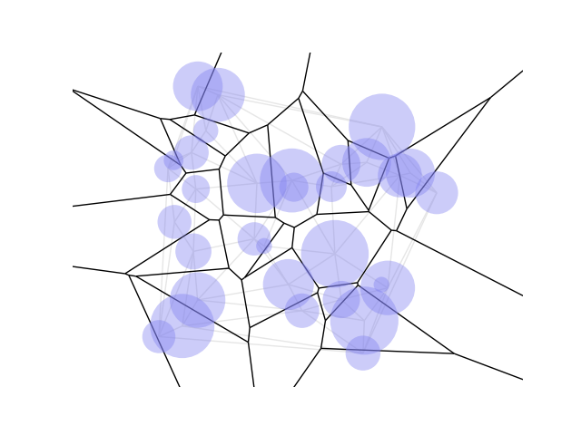
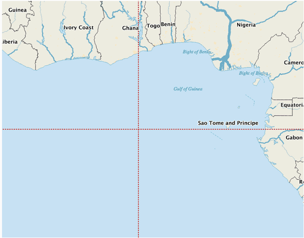
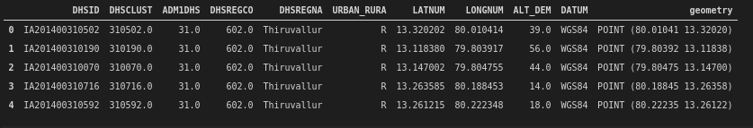
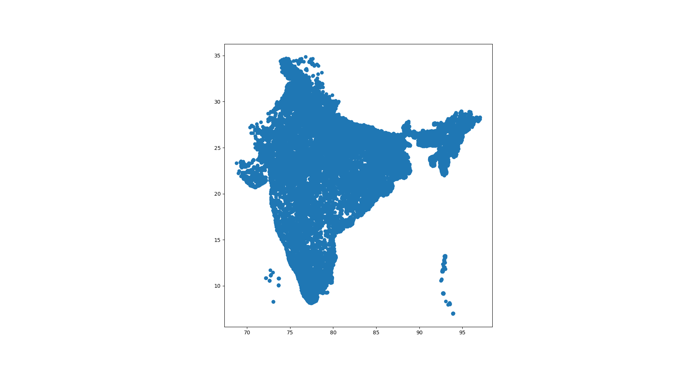
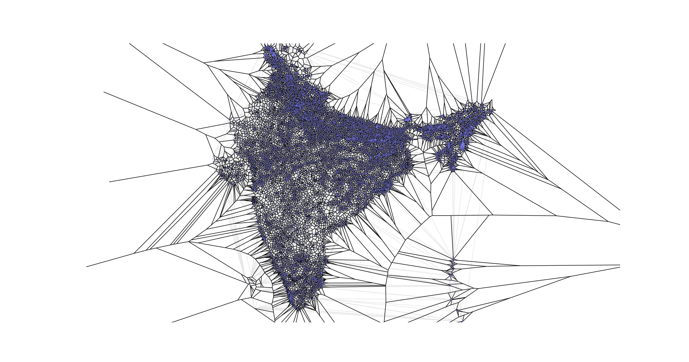

# Data Preparation for Geospatial Analysis & ML with Laguerre-Voronoi in Python

In this article the application of Laguerre-Vornoi tessellation to Demographic and Health Survey (DHS) data is explored. 
A pipeline for cleaning and transforming the DHS data is proposed along with the associated python code.

## Demographic and Health Survey data
DHS surveys contain confidential information that could potentially be used to identify an individual through unique information. To avoid this the [DHS Program](https://dhsprogram.com/) has developed an approach to degrade accuracy of the GPS coordinates so that true place of residence cannot be derived. In all DHS surveys the center GPS coordinate of the populated place in a cluster is recorded and separate degradation error values are applied depending on whether a cluster is _urban_ or _rural_. A random error of 5 km maximum in rural areas and 2 km maximum in urban areas is applied, this decreases the likelihood of household identification by tenfold. The new list of coordinates can be thought of as having a circular error buffer zone of (5km or 2km) within which the actual value resides. This degradation poses a challenge for further data analysis and machine learning tasks on this data.

## Laguerre Voronoi Diagrams
Introduced in 1985 in <a href="#ref1">[1]</a>, Laguerre Voronoi diagrams are an extension of the concept of Voronoi diagrams for $n$ points in the plane to that of Laguerre geometry for $n$ circles in the plane. It is a partition of the Euclidean plane into polygonal cells defined from a set of circles and are also known as [Power Diagrams](https://en.wikipedia.org/wiki/Power_diagram). The diagrams used in this article were generated from the [GitHub Gist](https://gist.github.com/sunayana/a3a564058e97752f726ca65d56fab529)


## Laguerre Voronoi Tessellation of DHS Data
Due to the nature of the degradation introduced in the DHS Data, Laguerre Voronoi tessellation of the DHS dataset is a viable model to create polygonal partition of the map of a country for further data analysis. India is taken as an example for introducing the pipeline.
### Preprocessing DHS Data
- Note that the intersection of 0 degrees latitude (Equator) and 0 degrees longitude(Prime Meridian) on the map falls in the middle of the Atlantic Ocean, in the Gulf of Guinea off the coast of western Africa.

<figure>
    
    <figcaption>Image from <a href="ref3">[3]</a> showing intersection of Equator and Prime Meridian.</figcaption>
</figure>
Hence all entries from any country specific DHS GeoDataFrame could be dropped which has both latitude and longitude entries are 0.0.

```python
class DHSGeographicData():
    """Class representing the DHS geographic dataset
    """

    def __init__(self, filename: str):
        try:
            self.country_gdf = gpd.read_file(filename)
        except fiona.errors.DataIOError as err:
            raise TypeError

    def clean(self):
        """Drops all rows with longitude = 0.0 and latitude = 0.0 as they are not valid for land data.
        """
        self.country_cleaned_gdf = self.country_gdf.loc[(
            self.country_gdf['LATNUM'] != 0.0) & (self.country_gdf['LONGNUM'] != 0.0)]

```
- Next extract the columns important for computation of the Laguerre-Voronoi diagrams using the method [`DHSGeographicData.extract_dhs()`]("https://github.com/dai-mo/gis-laguerre/blob/master/src/dhs_data.py")
Using the shapefile `IAGE71FL.shp` for India from geographic data [IAGE71FL.zip](https://dhsprogram.com/data/dataset/India_Standard-DHS_2015.cfm) after extraction, the following geodataframe is obtained:
 
 

- Then assign the weights to the different sites depending on whether they are _urban_ or _rural_ and extract the sites and weights using the method [`DHSGeographicData.get_sites_and_radii()`]("https://github.com/dai-mo/gis-laguerre/blob/master/src/dhs_data.py").

### Generate the Weighted Voronoi
Using the [Laguerre-Voronoi GitHub Gist](https://gist.github.com/sunayana/a3a564058e97752f726ca65d56fab529)
the weighted Voronoi tessellation is obtained using
```python
import os
from dotenv import load_dotenv
load_dotenv()

import dhs_data as dd
import laguerre_voronoi_2d as lv2d
import matplotlib.pyplot as plt 

dhs_geo_file = os.environ.get("DHS_DATA_DIR") + "/IAGE71FL_geographic_data/IAGE71FL.shp"
dhs_geo_data = dd.DHSGeographicData(dhs_geo_file)
dhs_geo_data.clean()
dhs_geo_data.extract_dhs()
(sites, weights) = dhs_geo_data.get_sites_and_radii()
tri_list, vor_vert = lv2d.get_power_triangulation(sites, weights)
voronoi_cell_map = lv2d.get_voronoi_cells(sites, vor_vert, tri_list)
```
A plot of the weighted Voronoi tessellation of the DHS cluster for India:



## Acknowledgements
## References
<ol>
    <li is="ref1">Imai, H., Iri, M. & Murota, K.(1985). Voronoi Diagram in the Laguerre Geometry and Its Applications, SIAM Journal of Computing, 14(1), 93--105. doi:10.1137/0214006</li>
    <li is="ref2"> Guidelines On The Use of DHS GPS Data https://dhsprogram.com/pubs/pdf/SAR8/SAR8.pdf</li>
    <li is="ref3"> What is at Zero Degrees Latitude and Zero Degrees Longitude? https://www.geographyrealm.com/zero-degrees-latitude-and-zero-degrees-longitude/</li>
    
</ol>